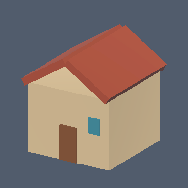
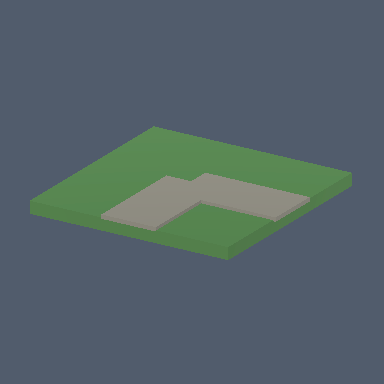
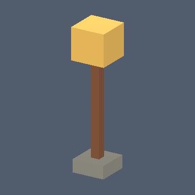
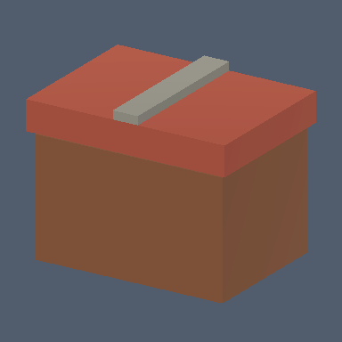

# CSCI/ATLS 4616: miniature world demo

This source branch adds a tabletop content and interaction slice to Matrix Operator. It uses the existing review/Apply, world executor, receipts, Undo, and schema-1 save/restore path. The original seven bundled props remain available. The new assets are original Unity-primitive compositions generated by `MiniatureCatalog`; no third-party asset or animation license is needed. The generator is shared by the Desktop, virtual Quest, and room AR builds.

## Content inventory

All new prefabs have a bottom support-plane pivot, primitive colliders, measured bounds in the runtime catalog, and a default scale of 1. They are roughly 2–20 cm wide at that scale. The original chair, table, wall, pedestal, block, orb and column retain their previous IDs and scale defaults.

| Category | New prefab IDs | Use |
| --- | --- | --- |
| Terrain | `grass_tile`, `dirt_tile` | 20 cm squares; put side by side |
| Roads | `road_straight`, `road_corner` | 20 cm segments; straight follows local Z, corner connects -Z to +X |
| Trees and plants | `pine_tree`, `oak_tree`, `shrub` | Forest and garden accents |
| Rocks | `rock`, `boulder` | Landscape variation |
| Buildings | `cottage`, `tower` | Village and landmark; entries face local -Z |
| Structures | `fence`, `bridge`, `well` | Boundaries and a village center |
| Interactive props | `street_lamp`, `chest` | Selectable lamp and hinged lid |

The Operator receives each asset's ID, display name, description, spawn scale, and measured bounds. `street_lamp` advertises `interactionMode: light`; `chest` advertises `interactionMode: hinge`. All other props have no selection toggle. Downloaded static packs remain static under the existing component policy.

Representative Unity Editor thumbnails of authored prefabs (not headset screenshots):

| Cottage | Road corner | Street lamp | Chest |
| --- | --- | --- | --- |
|  |  |  |  |

## Behaviors and interaction

`rotate` and `bob` retain their existing limits and behavior. `path` moves a prefab's visual and collider between two root-local points at 0.01–1 m/s, reversing at each endpoint. Each coordinate is within one metre of the root and the path length is 0.02–1 metre. The authoritative placed root stays fixed. Path phase resets on restore; path configuration, like rotate/bob configuration, is saved. Pause, disable, removal, delete, Undo, and redo go through the existing executor.

`select_toggle` is available only on the bundled lamp and chest. Apply it once to the object, then select the object in the app or through a reviewed `select` command. Selection switches the lamp's point light or opens/closes the chest lid. The on/open state is saved and Undo restores the previous state. A selection toggle in room AR needs confirmed room alignment. The whole object still has the same stable ID, anchor and placed pose.

The player advertises `rotate`, `bob`, `path`, and `select_toggle`; the PC service checks that advertised list before dispatching a behavior. The Operator also checks `interactionMode` before proposing a toggle. The player remains the final authority and reports the result in its command receipt. This does not add arbitrary scripts, general physics, autonomous navigation, or NPC reasoning.

## Repeatable demo

1. Build the source and PC service from this same checkout. For a rehearsal without a headset, run `./Build-WhiteRoom.ps1 -Target Desktop`, `./Start-ControlService.ps1`, and `./Builds/WhiteRoomDesktop/MatrixOperator.exe`. Open `http://127.0.0.1:8765/`. For the tabletop demo, run `./Build-RoomAR.ps1`, install `Builds/RoomARQuest/MatrixOperatorAR.apk` with the documented `adb install -r`, then run the service and `./Connect-QuestControl.ps1`. Use developer mode, authorized USB debugging, Space Setup, spatial permission, and a real table. Inspect the outlines and confirm alignment before editing.
2. Choose **Codex (ChatGPT subscription)** for open language requests, or manually use the prop controls. Aim at a clear tabletop patch and select it. The green marker is the placement point. Review and Apply each proposal, then wait for the player acknowledgement.
3. Ask: **“Build a small village on this table using a cottage, tower, well, road pieces and grass tiles. Keep all parts within this tabletop.”** Confirm IDs and positions in the proposal before Apply. If the table is too small, request fewer pieces or use the Desktop fixture. Do not assume a single prompt can attach behaviors to newly created objects; those receive IDs only after execution.
4. Ask: **“Add two pine trees and an oak behind the cottage. Put a lamp by the road and a chest near the cottage.”** Review and Apply. Select the lamp, then ask: **“Make this lamp switch when I select it.”** Review and Apply `set_behavior` with `kind: select_toggle`. Select the lamp again to switch it on. Repeat with the chest to open it.
5. Select a rock or other small prop. Ask: **“Move this object back and forth along a 20 cm path at 10 cm per second.”** Review the two local waypoints and speed, then Apply. The route must fit the available physical tabletop; the current path feature does not perform swept collision checks.
6. Make one ordinary transform edit. Use **Undo** and confirm the prior scene state. Save as `MiniVillage4616`, clear, then restore the save. Confirm object IDs, anchor alignment, path configuration, and lamp/chest state. On restore, motion begins at its initial phase.

## Validation and remaining device checks

The generated Desktop and virtual Quest Unity builds each passed 457 core checks, exercising all 16 new prefab registrations, bounds, selection, path movement, interruption, deletion, Undo, and save/restore of toggles. The PC passed 479 Python tests and all three panel suites. An isolated actual Windows player and PC service passed 27 checks including a real reviewed Codex proposal; a final post-polish run passed 24 checks. All 16 Unity Editor prefab thumbnails rendered successfully. The [validation summary](../Validation/miniature-world-validation.json) separates these results from the room-AR build failure and absent headset evidence. A successful virtual Quest APK does not establish table alignment, controller selection, visual comfort, frame rate, or a wearer-confirmed end-to-end AR loop. Before September 29, resolve the native room-AR build, run the full six-step demo on the intended headset and table, measure frame time in that scene, rehearse the service/USB connection, and record a backup video.

An animated rigged character is deferred: this checkout has no reviewed compatible rig and licensed idle/wave/walk clips. The finite prop interactions are the complete demo slice.
