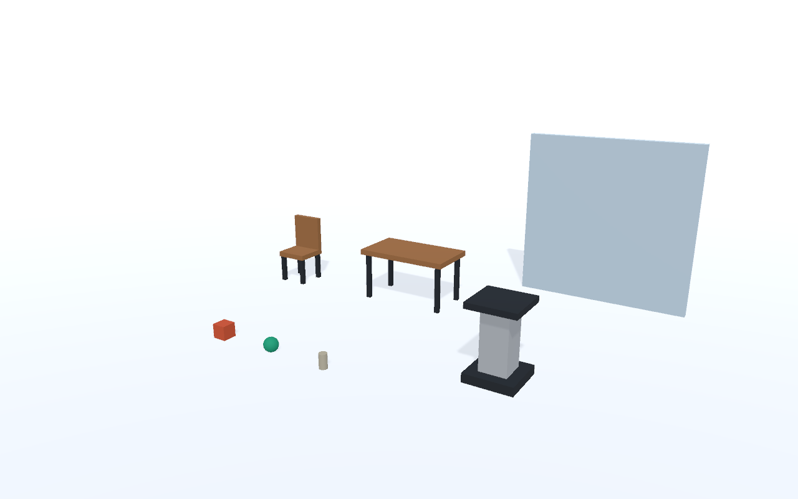

# Matrix Loading Operator

**Versioned downloads:** [GitHub Releases](https://github.com/School-of-the-Ancients/matrix-loading-operator/releases) preserves milestone APKs with matching PC services, source tags and checksums. See [versions and submission snapshots](Docs/Versions-And-Submissions.md) to run an earlier build or freeze a coursework version.

Matrix Loading Operator builds and edits scenes from bundled and installed prefabs using a PC-hosted Codex provider. The **virtual white room** and **room-aware AR** share controller selection, push-to-talk, model/reasoning selection, reviewed edits, undo/redo, and PC save/load. Props support live **Rotate** and **Bob** configurations. Quest Pro remains the validated AR device; the current expansion prepares Quest 3/3S camera access.

**Rendered scene feedback:** the Operator can now capture and preview the current virtual view and explicitly attach it to a typed request or the next headset voice request. Real Codex image input supplements the matching structured scene snapshot; read-only reviews, supported corrections, Apply, and Undo share the existing workflow. Default AR previews exclude physical passthrough. The new opt-in Quest 3 mixed mode uses SDK camera intrinsics to combine a physical frame with virtual rendering; hardware alignment validation is pending. The earlier graphical desktop run passed **83 checks with three real Codex turns**, including an image-only color observation and edit/undo/save/restore. **Quest Pro AR capture, a real AI image review, and capture-frame timings are recorded separately.** Start with the [visual feedback guide](Docs/Visual-Feedback.md) and [recorded evidence](Validation/visual-feedback-validation.json).

**Content library:** start with the [user guide](Docs/Content-Library-User-Guide.md) for rebuild requirements, manual preparation statuses, and AI usage. Open `/content` on the PC Operator service to search configured local/HTTP catalogs, install matching Unity prefab packs, track Asset Store preparation, and generate images with a reviewed local ComfyUI workflow. Newly installed props join the AI catalog and retain exact source/version references through scene saves. See the [connector guide](Docs/Content-Catalogs.md), [prefab pack exporter](Docs/Content-Packs.md), and [spatial/content validation](Validation/Spatial-Content-Validation.md). New scripts require a player build; animation/video/background-specific loaders remain future work.

Start here: **[Runtime behaviors](Docs/Runtime-Behaviors.md)** · **[Quest Pro room AR](Docs/Room-AR.md)** · **[Voice and model controls](Docs/Voice-And-Codex-Controls.md)** · **[Current checkpoint](Docs/Current-Checkpoint.md)**.

The new room-AR path uses passthrough and manually configured MRUK room data, first showing labeled outlines for wearer verification. Physical placement uses anchor-local geometry, measured prefab bounds and MRUK contact checks through the same executor and persistence system. Significant room changes retain read-only poses for save/clear/recovery; missing anchors reject restoration explicitly. See the room-AR guide for current build and hardware evidence. White-room headset results do not establish physical alignment. The first downloadable content path now supports trusted static prefab packs; broader animation, media and interactive content support remains incremental.

Build with `./Build-WhiteRoom.ps1 -Target Desktop` or `-Target Quest`. This creates a separate Unity-only project for each target under `.white-room-fixture/`; virtual mode uses standard Unity OpenXR and needs no MRUK room data or Meta Core. It preserves the original MR project and makes no antivirus changes. Run `./Start-ControlService.ps1` for offline commands, or `./Start-CodexControlService.ps1` for the selected ChatGPT/Codex subscription mode, then open <http://127.0.0.1:8765/>. Run `Builds/WhiteRoomDesktop/MatrixOperator.exe` for desktop use. For the already installed Quest app, run `./Connect-QuestControl.ps1` after reconnecting USB and open **Matrix Operator** manually from **Unknown Sources**. The installer succeeds at installation/forwarding but its implicit launch failed on the tested Quest OS.

The behavior increment passes **292 Python tests**, **301 Unity checks in each of the desktop, white-room Quest, and room-AR Quest builds**, and **46 actual Windows-player checks with four real Codex requests**. Rotate/Bob can coexist, pause, resume, and be removed; their configurations survive undo and save/load while animated visual offsets leave saved placement unchanged. A PC-derived skill catalog tells the AI which capabilities the connected player actually supports. General motion programs, interaction triggers, physics, and navigation remain proposed in the [LLMR runtime review](Docs/LLMR-Behavior-Runtime.md).

**Quest Pro acceptance passed:** actual headset speech asked the real Codex provider to rotate and float the existing orb. Both behavior commands were acknowledged; the wearer saw bobbing. **30 actual-device checks** passed across baseline movement/undo, pause/resume, removal/undo, and exact PC save/clear/restore. The wearer confirmed the restored orb remained on the same real table spot and kept bobbing. One post-restart room restoration with unchanged anchors was also verified. The original static orb is restored and selected; the animated version remains saved as **`AnimatedRoomBehavior_20260920_181054`**. Rotation was acknowledged but not separately visually verified on the uniform orb. See [headset evidence](Validation/behavior-headset-results.json), [complete behavior validation](Validation/behavior-validation.json), and [AI setup](Docs/AI-Integration.md).

To use AI, refresh the Operator page, select **Codex (ChatGPT subscription)**, type a request, choose **Create proposal**, review it, then **Apply reviewed proposal**. Wait for the runtime acknowledgement and keep controller edits idle during inference. If only the old offline option appears, refresh the page after starting the Codex service.

Unity Hub copies are available under **Desktop → Game Design → Matrix White Room Quest** and **Matrix White Room Desktop**. Use Unity **6000.6.0f1** and the exact scene paths in the [Desktop project guide](Docs/Desktop-Unity-Hub.md). The sibling **Matrix Loading Operator** checkout contains the full repository, copied builds and local saves. Check the current checkpoint before assuming these copies contain the latest source. The behavior work is on `codex/runtime-prefab-behaviors` in [PR #7](https://github.com/School-of-the-Ancients/matrix-loading-operator/pull/7), starting from the completed room-AR checkpoint `6962eaf`; the preceding AR work is in [PR #6](https://github.com/School-of-the-Ancients/matrix-loading-operator/pull/6).



The gallery is an arranged Editor preview; the app starts with an empty room.

<details>
<summary>Earlier physical-room / MRUK prototype documentation</summary>

The following sections document the separate AR/MRUK path. Its Windows simulation previously passed the spawn/edit/save/restore loop. Its Meta Core APK build encountered an antivirus quarantine, described in [the historical security report](Docs/Security-Block.md). That evidence is specific to the original MR build, not the virtual white-room build above.

## Connected learning layer

The separately preserved **Observation and Scale** prototype is an authored, cited activity backed by the `sota-v2` lesson runtime. Its optional PC panel is at <http://127.0.0.1:8765/learning>; the root page stays focused on the white-room Operator. Predict a block's change, revise it through the existing language proposal flow, record actual runtime evidence, explain it and reflect. PC saves can link the room to a durable lesson checkpoint; restoring it preserves later original progress. Completion records participation rather than a mastery grade.

Use sibling checkouts of this branch and `sota-v2`'s `codex/operator-learning-sessions` branch. With Node.js 24+, Python 3.10+ and Unity installed, run `./Build-DesktopFixture.ps1`. Start `npm run dev:operator` in the v2 checkout and `./Start-ControlService.ps1` here, then run `Builds/Desktop/AR-Sandbox.exe`. The isolated fixture builds the explicit Windows simulation without importing Meta packages; native Quest validation remains separate. See the [activity runbook](Docs/Learning-Sessions.md), [organization/research review](Docs/Organization-Review.md), and [learning-layer validation](Validation/Learning-Validation.md).

## Open a fresh clone

Clone this repository and add its root folder in Unity Hub. Install Unity **6000.6.0f1**; native Quest builds also require Android Build Support, SDK/NDK and OpenJDK. Unity resolves the pinned dependencies in `Packages/manifest.json` on import.

This repository contains source, scenes, prefabs, settings and sanitized validation summaries. Builds, imported SDK caches, credentials, local room saves and raw logs are excluded. The MIT license applies to the authored project code; Unity and Meta dependencies retain their respective licenses and are restored through Package Manager.

Open `Assets/Sandbox/Scenes/QuestSandbox.unity` for the native room application, or `DesktopFixture.unity` for the explicit simulation. Before batch-building, close the project's Editor. In PowerShell at the repository root, run `./Build-Desktop.ps1` or `./Build-Quest.ps1`; both accept `-UnityEditor` for a different editor executable location. Desktop builds from this full project also import the Meta SDK. The previously verified desktop build used an independent no-Meta fixture, so it is not proof that this full project currently imports successfully past the reported quarantine.

## Run the desktop prototype after building

1. In PowerShell at this project folder, run `./Start-ControlService.ps1` (Python 3.10+). Keep that terminal open.
2. Run the generated `Builds/Desktop/AR-Sandbox.exe` (not included in Git).
3. Open [the PC control panel](http://127.0.0.1:8765/). It explicitly identifies **DESKTOP SIMULATION**.
4. A simulated table is selected initially. In the player, click a surface to choose “here,” or click a prop to select “it.”
5. Enter each request below, choose **Create proposal**, inspect it, then **Apply reviewed proposal**. Wait for the runtime's acknowledgement before the next request.

```text
Put a block here
Make it twice as big
Move it 20 cm left
Rotate it 45 degrees
Put an orb here
Delete it
Save as Demo
Clear the scene
Load Demo
```

The restored block retains its original object ID, asset, room target, size, rotation, and anchor-local position. The same app stays running throughout. Directions are relative to the chosen surface axes, not the user's gaze. Save files are JSON in `ControlService/scenes`; repeating a name replaces that save atomically. Select a restored object again before saying “it.” Close the desktop simulation before connecting the Quest; the service pairs with one running application at a time.

## Quest Pro setup and native build

Source project: Unity **6000.6.0f1**, Meta Core/MRUK **205.0.0**, built-in rendering, OpenXR, ARM64 IL2CPP. Android SDK/NDK/JDK support was installed on the original validation workstation; install it through Unity Hub on a fresh machine. Open `Assets/Sandbox/Scenes/QuestSandbox.unity` (or **Sandbox → Open Quest scene**). `SandboxProjectSetup.Generate` creates bundled assets and both scenes through Unity Editor APIs.

After the security detection is resolved, close the project's Editor and run `./Build-Quest.ps1`. A successful build writes `Builds/Quest/AR-Sandbox.apk`; **that file does not currently exist**. `./Install-Quest.ps1` installs the APK and sets `adb reverse tcp:8765 tcp:8765` for one USB-authorized headset. Run the PC service, then launch AR Sandbox from the Quest's installed apps. No firewall changes are needed for this USB path.

In the standalone Quest Pro, use **Space Setup** to manually outline the floor and a table, then grant the app spatial-data permission. The application requests actual device **Scene Model V1**; it does not substitute the simulation or require Quest 3 depth/high-fidelity scanning. Room and surface UUIDs identify placements. Recreating the configured room can change those IDs; mismatched saves fail explicitly instead of shifting to a guessed origin.

Controllers:

- Right trigger: select a surface point or existing object. A: add prop. B: cycle prop.
- X: delete the selected object. Left stick: move. Right stick: rotate/resize.
- Y: retry room loading. **Left grip + Y:** open native Space Setup, then reload.
- Save and clear sandbox objects before room setup/reload; existing objects prevent it.

See [MRUK and Quest Pro details](Docs/MRUK-QuestPro.md) for setup, sample references, and the physical acceptance checklist. Real room setup must occur on-device; Link is not a substitute for this test.

## AI and offline language commands

The default **Offline commands** mode is a finite English parser, **not an AI model**. The newer **codex-cli** mode uses the PC's existing ChatGPT-authenticated Codex CLI and has passed the complete reviewed spawn/edit/save/clear/restore loop on Quest Pro. Unsupported offline language produces an error; it does not invent assets or IDs.

The replaceable AI adapter supports a configured OpenAI-compatible `/chat/completions` provider. Set `SANDBOX_AI_BASE_URL`, `SANDBOX_AI_MODEL`, and, for a remote provider, `SANDBOX_AI_KEY` in the service's environment, then restart it. It can also use explicitly configured OpenAI/OpenRouter key+model variables. No model is guessed from a key alone. Credentials stay in the PC process, outside Unity and scene saves. See [AI integration and supported phrases](Docs/AI-Integration.md).

The provider receives the request, available props, current objects, room targets, and selection. Proposals are validated, expire after two minutes, and are bound to the current application session and scene/selection revision. Applying a stale or already-used proposal fails; create another. Save/load intents run on the PC and require prior edits to finish. Current live-Codex results are recorded above; the compatible HTTP provider route has mock evidence. Voice input is not implemented.

## Validation and continuation

| Scope | Result |
| --- | --- |
| Unity core/application checks | 80 passed; independent no-Meta fixture |
| Actual Windows player + PC language/save loop | 41 passed; explicit offline parser and simulated room |
| PC HTTP service + AI adapter | See current `Validation/service-tests.txt`; includes mock provider, stale proposals, save/load and failure handling |
| Quest adapter Editor/Android source branches + build setup | C# metadata compilation passed; not a native APK build |
| Android build | Blocked by antivirus quarantine during Meta assembly compilation |
| Earlier MRUK headset + AI path | Not run; current virtual-room headset/Codex evidence is recorded above |

Reproduce PC tests with `python -m unittest discover -s ControlService -v`. Reproduce the actual player loop with `python Validation/Run-Prototype-Loop.py`; it uses a temporary service/save folder and terminates only its own test player. [Exact runtime evidence](Validation/prototype-loop-results.json), [core evidence](Validation/core-results.json), and the [durable progress log](Docs/Progress-Log.md) record what passed and how to resume. The [validation report](Validation/Prototype-Validation.md) separates source, simulation, build, and hardware results.

Published validation reports describe the original local runs and have workstation paths redacted. Raw logs remain local. See [handoff status](Docs/Publication.md) before resuming native validation.

</details>
