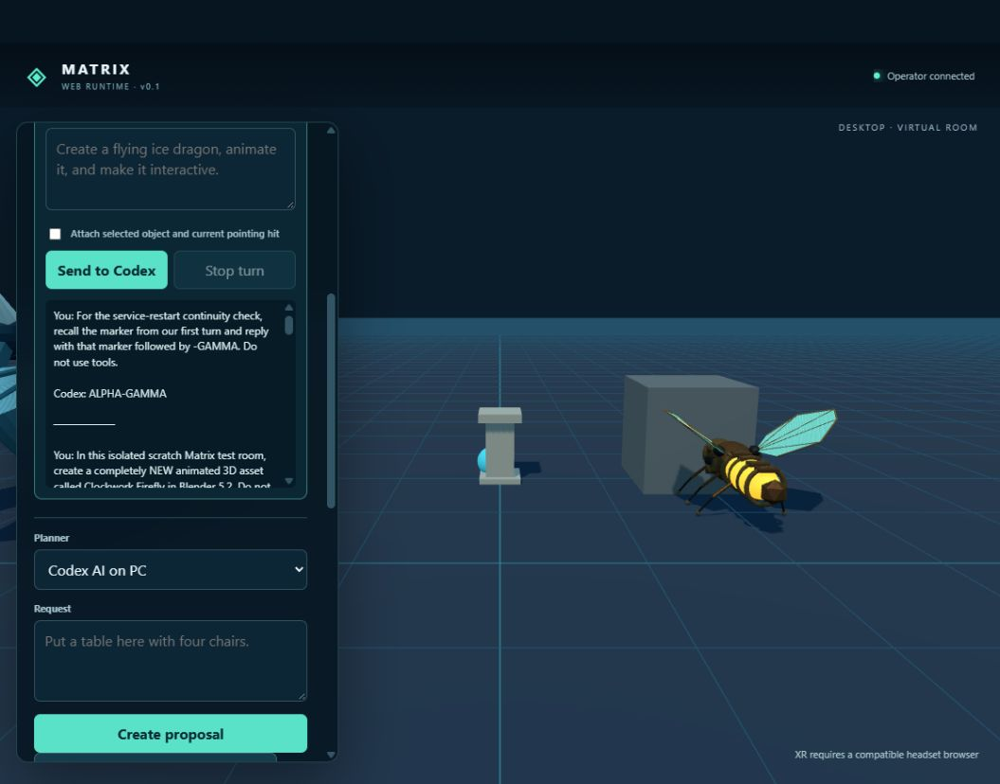

# Clockwork Firefly

An original, editable Blender 5.2 asset for the Matrix Web Runtime. Its segmented bronze body exposes a luminous amber abdomen, paired jade enamel wings on moving hinges, two antennae, clockwork gears, and six jointed legs. The preview plinth, camera, and lights are saved in the `.blend` for editing and rendering, but are excluded from the self-contained GLB.



## Files

- `build_clockwork_firefly.py` — procedural Blender source.
- `clockwork-firefly.blend` — editable authoring scene, including preview staging.
- `clockwork-firefly.glb` — validated runtime asset.
- `clockwork-firefly-preview.png` — rendered preview.
- `desktop-import.png` — screenshot of the newly registered GLB rendered in a live desktop `/web/` session.

From the repository root on the authoring PC, rebuild all three generated files with the installed Blender 5.2 executable:

```powershell
& 'C:\Program Files\Blender Foundation\Blender 5.2\blender.exe' -b --factory-startup --python WebRuntime/art/clockwork-firefly/build_clockwork_firefly.py
```

## Animation and validation

The GLB exports two named clips using object transforms and named NLA tracks:

| Clip | Intended Matrix binding | Duration |
| --- | --- | ---: |
| `Wingbeat` | Loop while on the virtual floor | 1.042 s |
| `Beacon Pulse` | One-shot selection response | 1.375 s |

`ControlService/web_assets.py:inspect_glb` accepts the self-contained export: 566,844 bytes, 79 meshes, 14,706 referenced vertices, no external images, and both clips. The initial export's SHA-256 is `15c42ffb780f17d535e4f1fc905bf3a28f3c91433c6fec5a156a65c0b1991e2f`. Three.js `GLTFLoader` parsed the file and its `AnimationMixer` advanced both the wing hinge and beacon scale. At the exported rest pose, rendered bounds measure about 2.455 × 1.077 × 2.421 metres (width × height × length); the runtime recenters it horizontally and places the lowest point on its virtual floor.

Register the GLB in the PC service's selected Web asset catalog before spawning it. Then bind `loopClip: "Wingbeat"` and `selectClip: "Beacon Pulse"` to its Matrix object. Registration alone does not alter a scene; placement and binding still need the normal runtime commands and observed receipts. This asset was built by the local Blender Python script above, not by Blender MCP.
