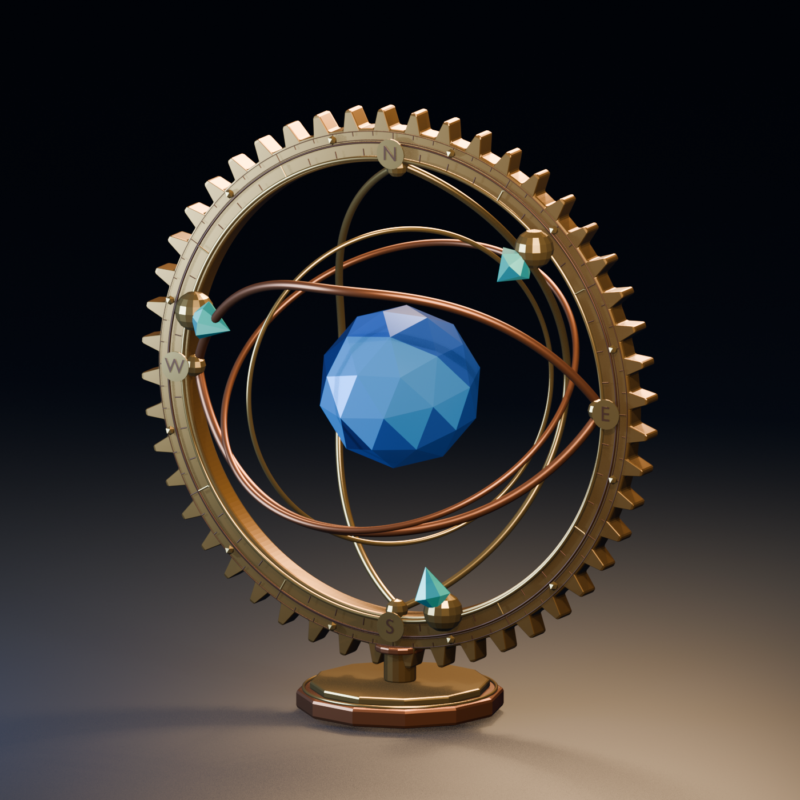

# Copper Astrolabe

This static, original asset was built and revised through Blender MCP in one continuing desktop Agent Portal conversation. Blender 5.2.2 LTS ran in a dedicated empty scratch GUI scene. The scene contains a 48-tooth brass ring, curved copper orbit struts, two gimbals, a faceted blue core, three turquoise finials, and a cardinal degree scale.

`copper-astrolabe-initial.blend` and `copper-astrolabe-initial.png` preserve the first draft. `copper-astrolabe-final.blend` and `copper-astrolabe-final.png` preserve the follow-up revision. The final self-contained runtime asset is `copper-astrolabe-final.glb`. Scripts `01_` through `07_` are the exact code sent through Blender MCP in authoring phases; `08_inspect_export.py` is the PC validation source. The save/export scripts contain the scratch directory used in this trace, so change `BASE` before reusing them elsewhere. The editable source and previews are outside the service's runtime catalog.

The exported GLB contains only evaluated model geometry. Its floor, camera, and lights remain in the `.blend` for preview work. `inspect_glb` accepted 1,694,104 bytes, 51 meshes, 50,130 referenced vertices, no external resources, and no clips. SHA-256: `4a239db63c676b1bedb3e106ecf7eb98dedfc58cbccddec841fda117ed7e1ffa`. Measured bounds are `(−1.452961, 0.025, −0.737716)` to `(1.452961, 3.152961, 0.737887)` metres.

The [desktop M1 trace](../../../Validation/WebRuntime-Blender-MCP-M1-2026-09-25.md) records the creation, revision, registration, runtime receipts, visual check, and browser reload. It does not establish Quest visibility or physical-surface placement.
